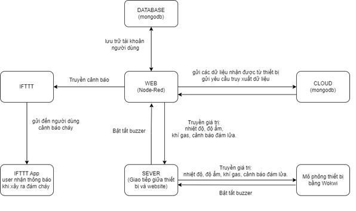

# IoT-Automatic-Fire-Alarm-Device
VNU - HCMUS

Grade: 10/10

**GIỚI THIỆU**

1. **Đề tài**

- Thiết bị báo cháy thông minh
- Link video demo: https://youtu.be/LZjdB4cA\_MQ

1. **Chức năng sản phẩm**

- Giám sát các thông tin như: Nhiệt độ, độ ẩm, cảm biến phát hiện lửa, loa báo cháy, LED báo cháy, cảm biến khí gas để cảnh báo tới người dùng.
- Tiếng còi và led báo cháy sẽ bật lên khi các giá trị của cảm biến đạt tới ngưỡng cháy và thông báo tới điện thoại người dùng.
- Các dữ liệu của nhiệt độ, độ ẩm, cảm biến phát hiện lửa, cảm biến khí gas, tài khoản người dùng được lưu trên cloud (mongoDB).
- Kiểm soát các tài khoản được cung cấp cho người sử dụng, chỉnh sửa, thêm, xóa người sở hữu thiết bị (chỉ dành cho NSX).
- Kiểm soát thiết bị báo cháy bằng web (bật/tắt các thành phần của thiết bị).
- Báo cho người dùng thông qua SMS khi có cháy xảy ra.

1. **Các công cụ sử dụng**

- Sử dụng node-red để thực hiện tạo website
- Sử dụng cloud mongoDB
- Báo về thiết bị điện thoại thông qua IFTTT
- MQTT truyền và nhận thông tin
- Autodesk Fusion 360 để thực hiện vẽ 3D
- Wokwi thực hiện lập trình thiết bị giả lập

**SƠ ĐỒ TRUYỀN VÀ NHẬN DỮ LIỆU**

1. **Hình ảnh**

1. **Mô tả**

**2.1. Website.**

Website được tạo bằng node-red hiện các thông tin liên quan cũng như là các tùy chọn để điều chỉnh thiết bị, người dùng sẽ đăng nhập bằng tài khoản được cung cấp để sử dụng web và thông tin về tài khoản sẽ được lưu trữ trên database là mongodb.

Từ trang web này ta sẽ điều khiển được hoạt động của các thiết bị như bật tắt led, buzzer thông qua MQTT server.

Thiết bị sẽ lấy các thông tin của cảm biến báo cháy trên thiết bị (nhiệt độ, độ ẩm, phát hiện lửa, nồng độ khí gas) để hiển thị bằng biểu đồ.

Lịch sử dữ liệu của thiết bị được lưu trên web và người dùng có thể tùy chọn lưu hoặc không.

Hiển thị lịch sử dữ liệu bằng biểu đồ (Line Chart).

Cloud sẽ lưu trữ dữ liệu thiết bị như sau:

- Giá trị nhiệt độ (℃).
- Phần trăm độ ẩm trong không khí (%).
- Đám cháy đang hoạt động (BOOL).
- Nồng độ khí gas.

Về thông tin tài khoản, được lưu trữ trên Cloud như sau:

- Id (unique): ID của tài khoản.
- Tên đăng nhập (username).
- Mật khẩu (chưa hash).
- Địa chỉ của người lắp đặt.
- Số điện thoại người dùng.

\* **Note:** Tài khoản của admin không lưu trên database.

Khi xảy ra đám cháy web sẽ gửi tin nhắn đến người dùng thông qua IFTTT app.

**2.2 Thiết bị.**

Thiết bị gửi các thông tin các giá trị nhiệt độ, độ ẩm, cảnh báo đang cháy thông qua MQTT server lên trên website sau đó web sẽ gửi các thông tin lên cloud (mongodb) để lưu trữ.

**WEBSITE**

1. **Thư viện sử dụng**
  1. Node-red-dashboard

- Node-red-dashboard: là thư viện dùng để thiết kế tất cả giao diện cần thiết cho website như biểu đồ, text, form,...

  1. Node-red-node-mongodb

- Node-red-node-mongodb: là thư viện dùng để lưu trữ và lấy dữ liệu từ cloud của mongoDB

  1. Node-red-node-ui-table

- Node-red-node-ui-table: sử dụng node table của thư viện để biểu diễn dữ liệu một cách thân thiện hơn.

  1. Node-red: Các chức năng và thao tác cơ bản của web.
1. **Các tab chính trên trang web:**

- Login: Màn hình chính.
- Admin: Chỉ sử dụng được sau khi đăng nhập là admin.
- Overview: Chỉ sử dụng được sau khi đăng nhập là user.
- Device: Chỉ sử dụng được sau khi đăng nhập là user.
- Chart: Chỉ sử dụng được sau khi đăng nhập là user.

**THIẾT BỊ GIẢ LẬP**

- link thiết bị: https://wokwi.com/projects/352279734667815937

1. **Thư viện sử dụng:**

Vì sử dụng Wokwi để giả lập, nhưng một số hạn chế Wokwi không có ESP8266 nên nhóm em sử dụng ESP32 với thư viện Wifi thay thế.

  1. **Wifi.h:** dùng để kết nối wifi.
  2. **PUbSubClient** : được sử dụng để sử dụng các phương thức giao tiếp MQTT giữa thiết bị và Web, thông qua 2 giao thức subscribe và publish.
  3. **DHT.h** : thư viện hỗ trợ sử dụng cảm biến nhiệt độ, độ ẩm DHT22
  4. **LiquidCrystal\_I2C.h:** điều khiển màn hình lcd 16x2
1. **Các cảm biến sử dụng:**

- Cảm biến nhiệt độ, độ ẩm DHT22: Thông báo nhiệt độ và độ ẩm.
- Cảm biến nồng độ khí Gas: Sử dụng cảm biến ánh sáng thay thế (Vì không có cảm biến khí gas trên Wokwi).
- Màn hình LED 16x2: Hiển thị cảnh báo trên thiết bị.
- Đèn LED báo cháy.
- Còi Buzzer.

1. **Cách hoạt động:**

- Cảm biến nhiệt độ DHT22 liên tục đo nhiệt độ và độ ẩm gửi về website, và đưa thông tin hiển thị trên lcd.
- Buzzer sẽ phát ra âm thanh khi xuất hiện lửa.
- Lcd hiện thông tin: nhiệt độ và trạng thái đám cháy hiện tại.
- Khi xảy ra đám cháy thiết bị gửi thông tin về web sau đó web sẽ gửi yêu cầu cho app IFTTT app để gửi thông báo đến người dùng.
- Người dùng sẽ được cấp tài khoản và có quyền điều khiển các thiết bị thông qua web.
- 2 led đóng vai trò hiển thị trạng thái:

- Đèn đỏ nhấp nháy, đèn xanh tắt: không phát hiện lửa
- Đèn đỏ bật sáng, đèn xanh tắt: lửa nhỏ
- Đèn xanh và đèn đỏ bật: lửa vừa
- Đèn xanh bật, đèn đỏ tắt: đang cháy
- Đèn đỏ tắt đèn xanh nhấp nháy liên tục: cháy lớn

**ĐÁNH GIÁ ĐỘ PHỨC TẠP CỦA WEB**

- **Các tính năng của website:**
  - Giám sát các thông tin như: Nhiệt độ, độ ẩm, cảm biến phát hiện lửa, loa báo cháy, LED báo cháy, cảm biến khí gas để cảnh báo tới người dùng.
  - Tiếng còi và led báo cháy sẽ bật lên khi các giá trị của cảm biến đạt tới ngưỡng cháy và thông báo tới điện thoại người dùng.
  - Các dữ liệu của nhiệt độ, độ ẩm, cảm biến phát hiện lửa, cảm biến khí gas, tài khoản người dùng được lưu trên cloud (mongoDB).
  - Kiểm soát các tài khoản được cung cấp cho người sử dụng, chỉnh sửa, thêm, xóa người sở hữu thiết bị (chỉ dành cho NSX).
  - Kiểm soát thiết bị báo cháy bằng web (bật/tắt các thành phần của thiết bị).
  - Báo cho người dùng thông qua SMS khi có cháy xảy ra.

- **Đánh giá độ phức tạp của website** : Web không quá phức tạp, đầy đủ tính năng hỗ trợ người dùng.
